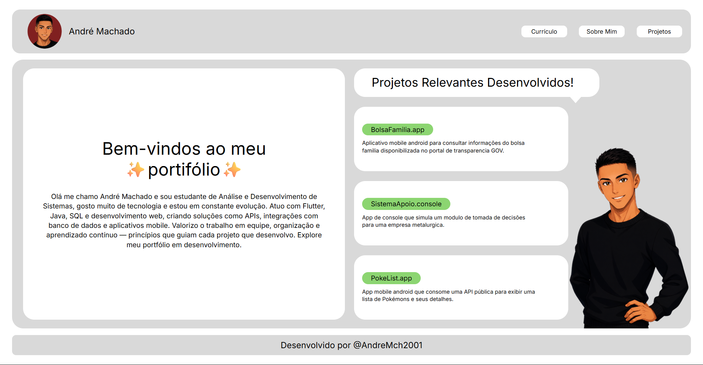

# Portfólio — André Machado

Site pessoal de apresentação profissional, com links para currículo, LinkedIn e projetos no GitHub.

## Sobre

Sou estudante de Análise e Desenvolvimento de Sistemas. Gosto de tecnologia e estou em constante evolução. Atuo com Flutter, Java, SQL e desenvolvimento web, criando soluções como APIs, integrações com banco de dados e aplicativos mobile.

## Projetos em destaque

- **BolsaFamilia.app** — App Android para consultar informações do Bolsa Família no Portal da Transparência.
- **SistemaApoio.console** — App de console que simula um módulo de tomada de decisões para uma empresa metalúrgica.
- **PokeList.app** — App Android que consome uma API pública para listar Pokémons e seus detalhes.

## Tecnologias

HTML · CSS · Flutter · Java · SQL

## Como visualizar

Abra o arquivo `index.html` no navegador ou acesse: https://andremch.netlify.app

## Contato

- GitHub: [@AndreMch2001](https://github.com/AndreMch2001)
- LinkedIn: [André Machado](https://www.linkedin.com/in/andré-machado-4abba4195/)
